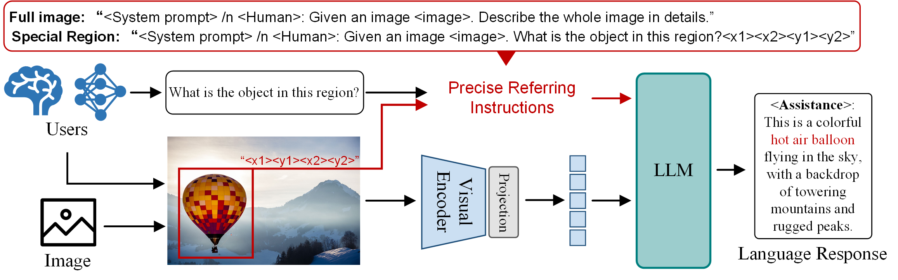

<p align="center">
  <a href="#">
</a>
  <h1 align="center"><font color="#966661">ChatSpot</font></h1>
</p>


<h3><a href="">ChatSpot: Bootstrapping Multimodal LLMs via Precise Referring Instruction Tuning</a></h3>

[Liang Zhao*](), [En Yu*](https://ahnsun.github.io/), [Zheng Ge](https://joker316701882.github.io/), [Jinrong Yang](https://yancie-yjr.github.io/), [Haoran Wei](https://scholar.google.com/citations?user=J4naK0MAAAAJ&hl=en), [Hongyu Zhou](), [Jianjian Sun](), [Yuang Peng](), [Runpei Dong](https://runpeidong.github.io/), [Chun Han](), and [Xiangyu Zhang](https://scholar.google.com/citations?user=yuB-cfoAAAAJ&hl=en)

<a href="https://arxiv.org/pdf/2307.09474"></a> 

ChatSpot is an innovative multimodal large language model (MLLM) developed to enhance human-AI interactivity by supporting precise referring instructions. This model aims to overcome the limitations of traditional end-to-end MLLMs, which only allow interaction through language instructions, thus restricting interactive accuracy and efficiency. ChatSpot introduces a new level of interaction by utilizing various reference representations, such as points and bounding boxes, to focus on specific regions of interest within images or scenes.




Dataset, code, and demo will be released soon.

## Contents

- [Datasets](#Datasets)
- [Code](#code)

## Datasets

Dataset (MGVLID) will be coming soon.

## Code

Our ChatSpot is build based on the our proprietary framework MMGPT, which many advanced MLLM models, i.e., [Merlin](https://github.com/Ahnsun/merlin), also utilize this framework. Please refer to Merlin for more information about the codebase.


## Contact
If you have any questions related to the code or the paper, feel free to email En Yu (`yuen@hust.edu.cn`).

## License
Our model and weights are licensed for both researchers and commercial entities, upholding the principles of openness. The license is drafted by modification of the license of [LLaMA](https://github.com/facebookresearch/llama).

See the [LICENSE](./LICENSE), as well as our accompanying [Acceptable Use Policy](./USE_POLICY.md).

## Citation

If you find our work useful in your research, please consider citing ChatSpot:
```tex
@article{zhao2023chatspot,
  title={Chatspot: Bootstrapping multimodal llms via precise referring instruction tuning},
  author={Zhao, Liang and Yu, En and Ge, Zheng and Yang, Jinrong and Wei, Haoran and Zhou, Hongyu and Sun, Jianjian and Peng, Yuang and Dong, Runpei and Han, Chunrui and others},
  journal={arXiv preprint arXiv:2307.09474},
  year={2023}
}
```
